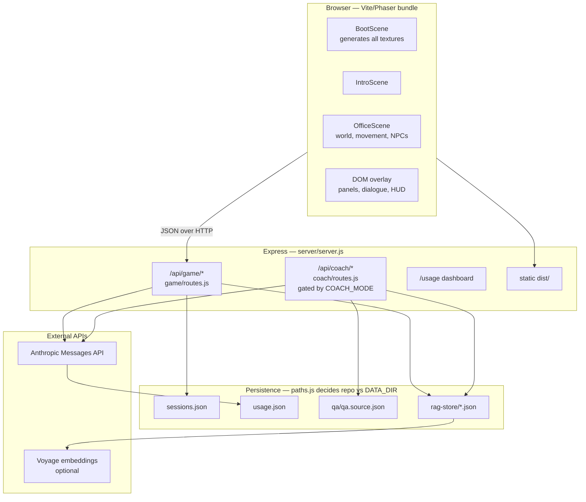
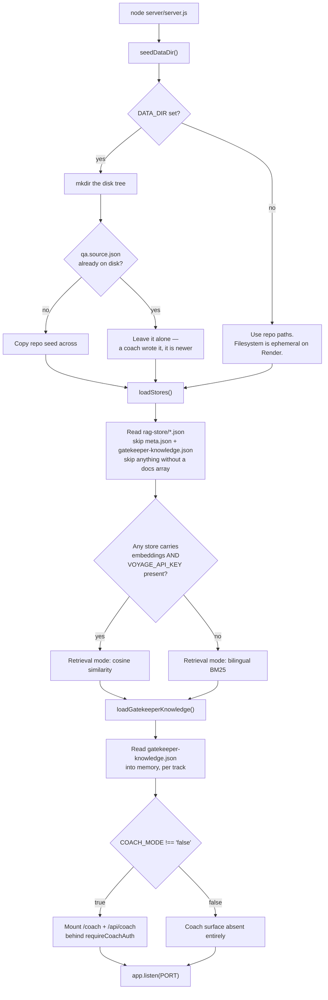
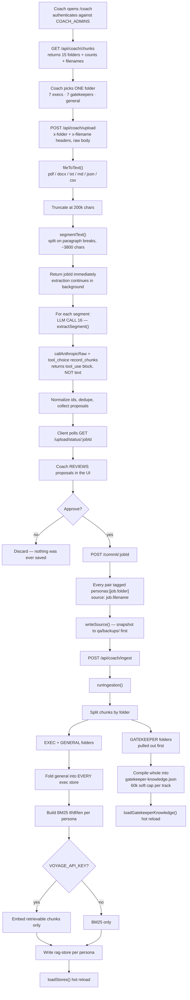
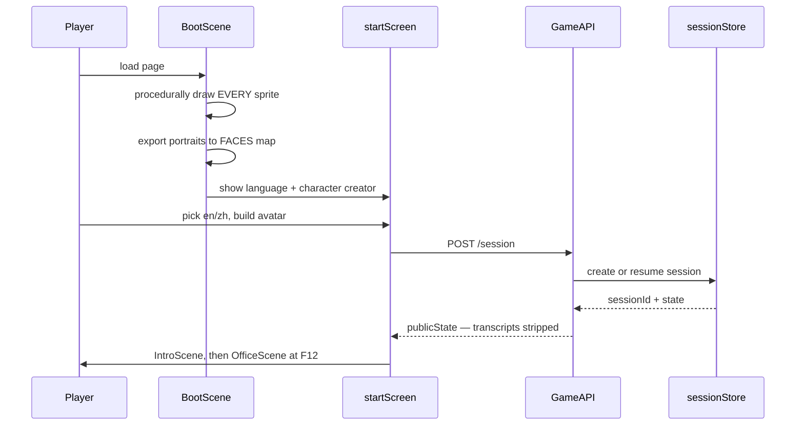
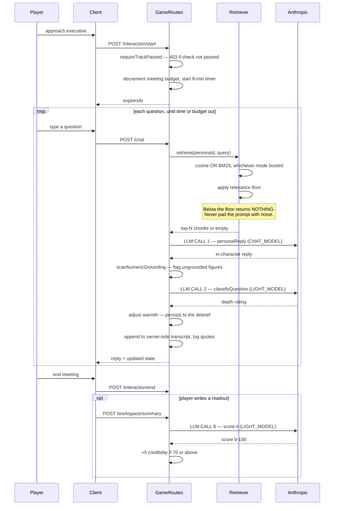
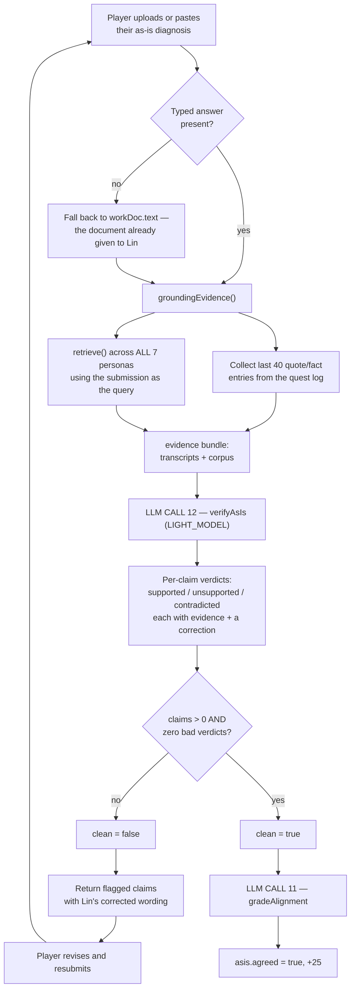
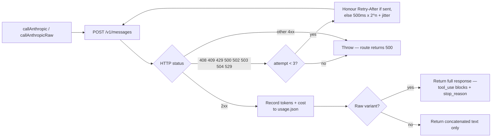
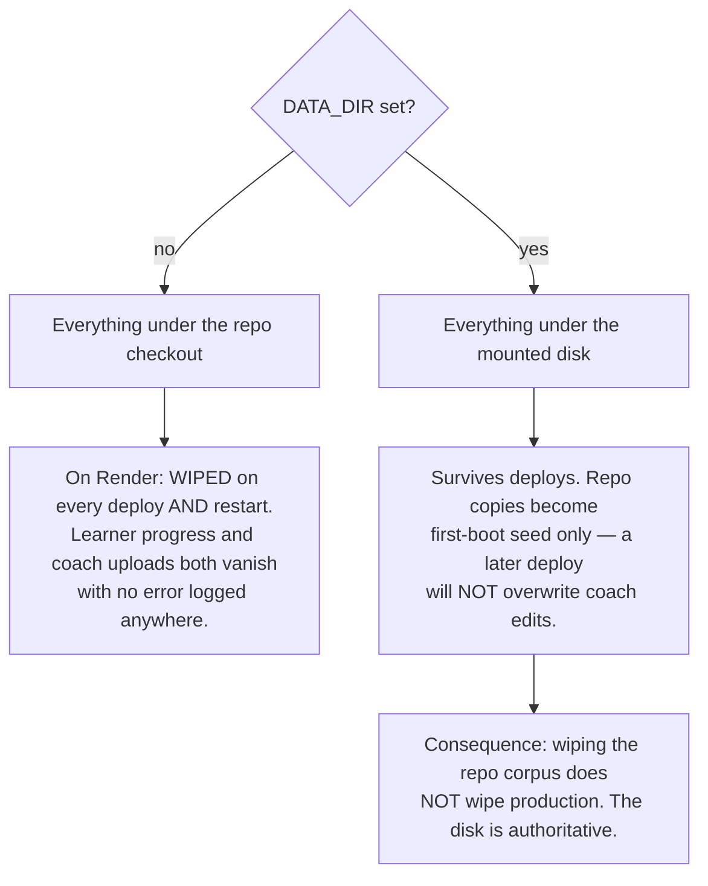

# ATHENA — Complete System Workflow

Every operation the system performs, from process boot to the closing debrief,
with each Anthropic API call marked at the point it fires.

Diagrams are Mermaid. GitHub renders them natively; in VS Code use the Markdown
Preview Mermaid extension.

**Verified against the code on 2026-08-03.** Line references are to the commit
this document was added in. Grep before trusting a line number.

---

## 1. Topology

Three processes' worth of concern in one Node server, plus a static client.

**Key design property:** the server is authoritative for every gate. The client
renders guidance and can be lied to; it cannot unlock anything. Each gate is
enforced a second time in the route that would benefit from it.

---

## 2. Server boot

Boot is **fail-loud but non-fatal**: a missing store directory logs a warning and
disables retrieval rather than crashing, so the game still runs with personas
answering from their static `knowledge` only.

---

## 3. Content pipeline — coach console to persona memory

This is the only path by which knowledge enters the game. It runs entirely
outside a play session.

**Why the split matters.** Executive folders become *searchable* indexes queried
per question. Gatekeeper folders are *not* searchable — they are pasted whole
into the prompt that writes the quiz, because a quiz author needs the entire
syllabus at once, not the three chunks nearest a query.

**Isolation is structural.** Each persona's index physically contains only its
own folder plus `general`. The CFO cannot surface the CTO's material regardless
of phrasing, because that material is not in the file being searched. This is
not a prompt instruction that could be talked around.

---

## 4. Client boot and session start

`publicState()` is the trust boundary: full interview transcripts live
server-side and are never shipped to the browser.

---

## 5. The engagement — full progression

The spine. Five phases, each closing with Manager Lin except where noted.

```mermaid
flowchart TD
  START(["Spawn at F12 reception"]) --> M1["Talk to Manager Lin"]
  M1 --> M2["dialogue-check — deterministic MCQ<br/>no LLM"]
  M2 --> M3["flags.metSupervisor = true<br/>+credibility"]
  M3 --> M4["linToolsBrief + linWorkPlan<br/>notebook handed over"]
  M4 --> M5["Case brief PDF downloads<br/>to the player's computer"]
  M5 --> M6["linBriefDiagnose"]
  M6 --> PHASE1

  subgraph PHASE1["PHASE 2 — AS-IS / DIAGNOSE"]
    T1["Open mission board M<br/>pick any of 7 tracks"] --> T2["F10 — talk to the gatekeeper"]
    T2 --> T3["LLM CALL 3 — gatekeeper reply"]
    T3 --> T4["TAKE CHECK"]
    T4 --> T5["LLM CALL 4 — write 5 MCQs<br/>FROM THIS CONVERSATION"]
    T5 --> T6["Answer them — graded by<br/>integer comparison, no LLM"]
    T6 --> T7{"All 5 correct<br/>eventually?"}
    T7 -->|no| T6
    T7 -->|yes| T8["task.status = passed<br/>credibility scaled by first-try<br/>accuracy, 50% floor"]
    T8 --> T9["Matching F15 executive UNLOCKED"]
    T9 --> T10["F15 interview — see section 6"]
    T10 --> T11{"All 7 tracks passed?"}
    T11 -->|no| T1
    T11 -->|yes| T12["Write the diagnosis in your OWN document"]
    T12 --> T13["Take it to Lin — upload or paste"]
    T13 --> T14["LLM CALLS 11 + 12<br/>grade + claim-by-claim verify"]
    T14 --> T15{"Every claim<br/>supported?"}
    T15 -->|no| T16["Flagged claims returned<br/>with Lin's corrected wording"]
    T16 --> T12
    T15 -->|yes| T17["alignments.asis.agreed = true<br/>+25 credibility"]
  end

  T17 --> PHASE2

  subgraph PHASE2["PHASE 3 — BENCHMARK"]
    B1{"All 7 executives<br/>interviewed?"} -->|no| B2["Lin refuses the meeting"]
    B2 --> B1
    B1 -->|yes| B3["Submit benchmark conclusion"]
    B3 --> B4["LLM CALL 11 — gradeAlignment"]
    B4 --> B5{"Agreed?"}
    B5 -->|no| B3
    B5 -->|yes| B6["alignments.benchmark.agreed = true"]
  end

  B6 --> PHASE3

  subgraph PHASE3["PHASE 4 — TO-BE / DESIGN"]
    D1["Draft the 5-year strategy"] --> D2["Interim readout to Lin"]
    D2 --> D3["LLM CALL 13 — grade readout"]
    D3 --> D4{"pass or partial?"}
    D4 -->|fail| D1
    D4 -->|yes| D5["flags.interimDone = true<br/>+30 or +15"]
  end

  D5 --> PHASE4

  subgraph PHASE4["PHASE 5 — PITCH"]
    P1{"7 interviews AND<br/>interimDone?"} -->|no| P2["403 — board will not convene"]
    P1 -->|yes| P3["F16 boardroom unlocks"]
    P3 --> P4["Optional: LLM CALL 7<br/>pre-submit deck review"]
    P4 --> P5["Pitch — LLM CALL 5 per turn"]
    P5 --> P6["LLM CALL 6 — board verdict"]
    P6 --> P7["LLM CALL 9 — challenge questions"]
    P7 --> P8["LLM CALL 10 — grade the defence"]
    P8 --> P9["Score = 60% deck + 40% defence"]
  end

  P9 --> F1["Return to Lin on F12"]
  F1 --> F2["LLM CALL 15 — closing debrief"]
  F2 --> F3["flags.debriefDone = true<br/>+15 credibility"]
  F3 --> DONE(["Engagement complete —<br/>requires debriefDone"])
```

---

## 6. Executive interview loop (F15)

The most expensive loop in the system: two LLM calls per player turn.

**Warmth** is a hidden per-executive score of question quality. It never blocks
anything; it surfaces at the debrief, where shallow questioning is named.

---

## 7. As-Is verification — the anti-hallucination gate

The most interesting logic in the codebase. Two LLM calls with different jobs.

**What this checks is grounding, not truth.** A claim passes if it is supported
by the transcripts or the project files. If the coach uploads something false,
a claim repeating that falsehood is "supported". The gate stops invention, not
error — worth stating plainly to anyone who asks whether it validates accuracy.

---

## 8. Complete Anthropic call inventory

Every call in the product. `CHAT_MODEL` and `LIGHT_MODEL` both default to
`claude-sonnet-5` and are independently overridable by environment variable.

| # | Site | Fires on | Model | Purpose | RAG? |
|---|------|----------|-------|---------|------|
| 1 | `routes.js:166` `personaReply()` | every `/chat` and `/board/chat` turn | CHAT | Executive or deputy replies in character | **yes** |
| 2 | `routes.js:180` `classifyQuestion()` | every `/chat` turn | LIGHT | Rate question depth, drives warmth | no |
| 3 | `routes.js:413` | `/gatekeeper/chat` | CHAT | Gatekeeper briefing conversation | no — compiled knowledge |
| 4 | `routes.js:491` | `/gatekeeper/quiz` | LIGHT | Write 5 MCQs from the conversation just had | no |
| 5 | `routes.js:767` | `/board/chat` | LIGHT | Board-room judgment during the pitch | no |
| 6 | `routes.js:820` | `/board/end` | LIGHT | Final board verdict | no |
| 7 | `routes.js:880` | `/board/review-deck` | CHAT | Pre-submission deck critique | no |
| 8 | `routes.js:956` | `/workspace/summary` | LIGHT | Score an interview readout 0-100 | no |
| 9 | `routes.js:997` | `/board/defense/questions` | LIGHT | Generate per-executive challenge questions | no |
| 10 | `routes.js:1032` | `/board/defense/grade` | LIGHT | Grade the live defence | no |
| 11 | `routes.js:1139` `gradeAlignment()` | `/alignment/asis`, `/alignment/benchmark` | LIGHT | Agree or reject an alignment submission | no |
| 12 | `routes.js:1219` `verifyAsIs()` | `/alignment/asis` | LIGHT | Claim-by-claim grounding check | **yes** |
| 13 | `routes.js:1386` | `/interim` | LIGHT | Grade the interim readout | no |
| 14 | `routes.js:1477` | `/review-work` | CHAT | Audit an uploaded working document | no |
| 15 | `routes.js:1575` | `/debrief` | LIGHT | Closing narrative feedback | no |
| 16 | `coach/routes.js:228` `extractSegment()` | `/api/coach/upload`, per segment | CHAT | Document to Q&A pairs via `tool_use` | no |
| 17 | `grading.js:16` | **offline eval only** | LIGHT | Legacy 2-question quiz grader | no |
| 18 | `injectionEval.js:43` | offline eval | CHAT | Probe a persona with an injection attempt | no |
| 19 | `injectionEval.js:63` | offline eval | LIGHT | Judge whether the guard held | no |

### Transport behaviour, applied to all of the above

`callAnthropic()` discards non-text blocks. Anything relying on `tool_use`
**must** use `callAnthropicRaw()` — this was a real bug that made coach upload
silently impossible.

---

## 9. What is deliberately NOT an LLM call

Worth knowing, because it is where the system is fast, free and deterministic.

| Operation | Mechanism |
|---|---|
| MCQ answer marking | `choice === m.correct` integer comparison |
| Credibility arithmetic | `track.credibility * (0.5 + 0.5 * firstTryRatio)` |
| Lin's opening dialogue check | Fixed options, fixed correct index |
| Every phase gate | Boolean flags on the session |
| Executive unlock | `tasks[taskId].status === "passed"` |
| Board unlock | 7 interviews AND `interimDone` |
| Engagement completion | `board.done && board.result && debriefDone` |
| Phase derivation | `syncEngagement()` — first incomplete phase wins |
| Objective guidance | `computeObjective()` — pure function of state |
| Meeting budget and timers | Server-side counters and timestamps |
| Persona knowledge isolation | Separate files on disk |

The rule: **LLMs judge prose; arithmetic and gates are code.** No gate anywhere
depends on a model returning well-formed output.

---

## 10. Persistence and failure modes

| Failure | Behaviour |
|---|---|
| No `ANTHROPIC_API_KEY` | Coach upload 500s with a clear message; game chat throws |
| Anthropic 529 overloaded | Retried up to 3 times, then surfaced |
| No `VOYAGE_API_KEY` | Silent, correct fallback to BM25 |
| RAG store missing | Warning; retrieval disabled; personas use static knowledge |
| Store file malformed | That file skipped with a warning; others still load |
| Model returns unparseable JSON | Graders default to the **harsh** outcome — never award credit for garbage |
| Retrieval finds nothing relevant | Returns empty rather than padding the prompt |

---

## 11. Known stale paths

Honest notes for whoever maintains this next.

- **`server/game/grading.js`** documents itself as backing a live
  `/gatekeeper/grade` endpoint. That endpoint no longer exists — the check is
  now 5 MCQs marked deterministically. The module is reached only by
  `server/eval/graderEval.js`, so the offline calibration harness is grading a
  prompt production never runs.
- **`shared/workspace.js`** and the `/workspace/add` and `/workspace/remove`
  routes are partially vestigial. Data packs are still granted and stored, but
  the structured authoring panel that consumed them was removed from the client.
- **`ws*` strings in `src/i18n.ts`** describe an "Engagement Binder" panel that
  no longer renders. Nothing reads most of them.
- **`shared/reviewCriteria.js`** still carries 7 `PLACEHOLDER` entries, so
  per-executive document-review standards are not fully authored.
